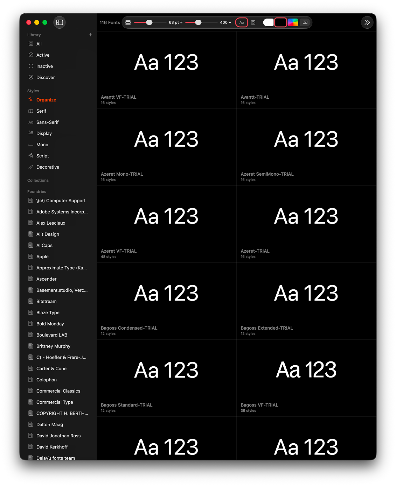
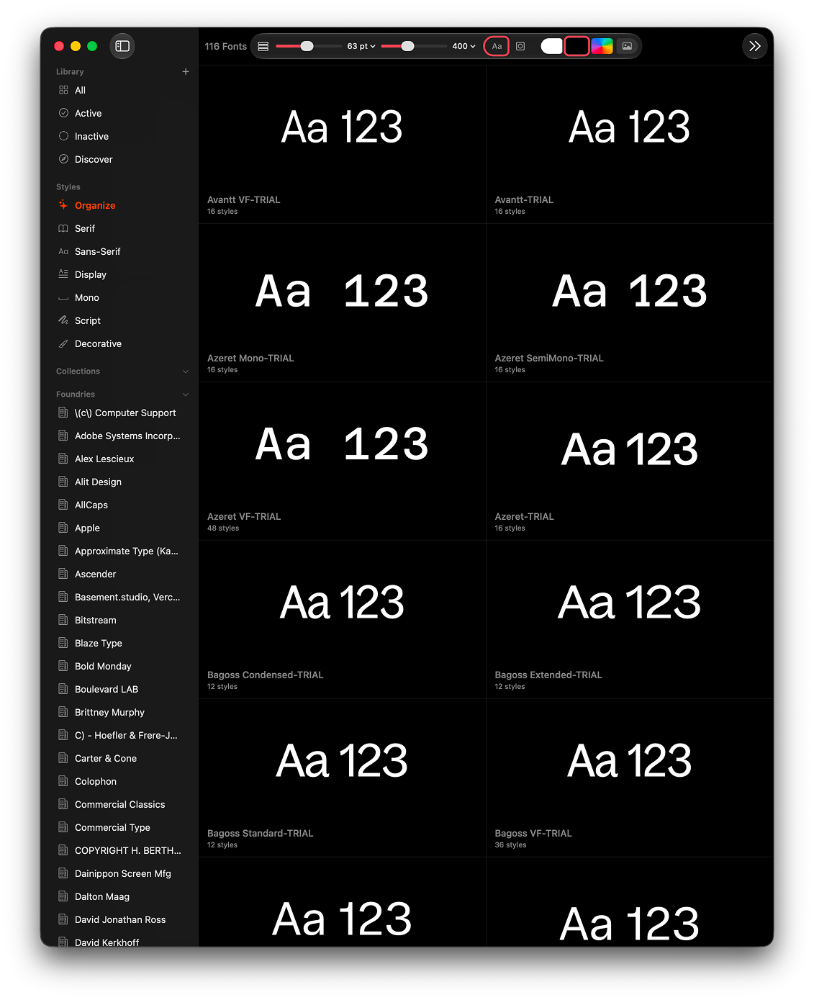

# Pica — watched-folder preview fix

Font previews in [Pica](https://pica.joshpuckett.me/) fall back to a generic
"Aa 123" (the system font) for every font that lives **only** in a watched
folder and isn't also installed on the Mac. Fonts that happen to be installed
preview correctly, so a mixed library shows a scattered split of real
typefaces and fallbacks.

This repo is a bug report + a working fix for the Pica developer.

> Heads up: I'm a designer, not a developer. This was investigated and tested
> with Claude Code. Treat the technical detail as a well-tested starting point,
> not authoritative.

## Before / after

Same view, same window, same fonts in the same positions — all living only in a
watched folder. Clearest tell: the Azeret Mono / SemiMono / VF rows, flat in the
before and rendering as their real wide-spaced monospaced faces in the after.

**Before** — real typefaces fall back to the system font:

**After** the fix — every preview renders in its true typeface:

## Cause

Pica reads the font files fine — names, foundries and style counts are all
correct. It's only the **render** that fails. The preview resolves each font by
its PostScript **name** (`NSFont(name:)` / a name-only `CTFontDescriptor`),
which only succeeds for fonts already registered with CoreText — i.e. installed
or activated on the system.

A watched folder is, by design, fonts you *haven't* installed. Pica never
registers them with CoreText (instrumenting a launch showed zero
`CTFontManagerRegisterFontsForURL` calls), so the name lookup returns nil and
the tile falls back to the system font.

This is why FontBase doesn't have the problem: it's Electron and draws previews
straight from the file via `@font-face`, never consulting the system font list.
A native app has to load the font from its file deliberately.

## Fix

Two native routes get the same result:

1. **Render from the file directly** — keep the URL-bearing descriptor from
   `CTFontManagerCreateFontDescriptorsFromURL` and draw with
   `CTFontCreateWithFontDescriptor`. (The `@font-face` equivalent.)
2. **Register at process scope on launch** —
   `CTFontManagerRegisterFontsForURL(url, kCTFontManagerScopeProcess, NULL)`.
   In-process only: nothing is installed, nothing appears in Font Book or other
   apps, and it all clears when Pica quits — consistent with the
   "include without installing" promise.

`picafix.m` in this repo is route 2 as a ~30-line proof: on launch it reads
Pica's `catalog.json` and registers every listed font at process scope. Across a
~10,000-font library it completed in the background in about 30 seconds, after
which every preview rendered.

## Reproducing

Point a watched folder at fonts that aren't installed anywhere else on the Mac,
then open the library grid — those tiles show the fallback; anything also
installed shows correctly.

Note you may **not** see this on your own machine: fonts your font manager has
activated are registered with the OS and preview fine. It only surfaces with a
watched folder of genuinely-not-installed fonts, and may be easier to see at
scale (large library).

## `demo/` — seeing the fix live

`demo/build.sh` builds a throwaway **"Pica (Patched).app"** from your installed
`Pica.app` by embedding `picafix.m` as a dylib. This is only a way to *watch the
fix work* against the shipping binary — **not** the real fix, which is a few
lines in Pica's own source (above). The patched copy is ad-hoc signed with
auto-update disabled; delete it after.
